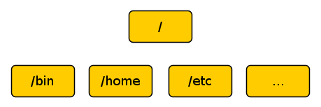

The first thing we need to learn to do (besides just typing) is how to
navigate the file system on our Linux system. In this lesson we will
introduce the following commands:

- __pwd__   
  
  Print name of current working directory
- __cd__     
  
  Change directory
- __ls__     
  
  List directory contents
                                 
pretty easy commands.

## Understanding The File System Tree
Like Windows, a Unix-like operating system such as Linux organizes its files
in what is called a _hierarchical directory structure_. This means that they are
organized in a tree-like pattern of directories (sometimes called folders in
other systems), which may contain files and other directories. The first
directory in the file system is called the root directory. The root directory
contains files and subdirectories, which contain more files and subdirectories
and so on and so on.  

Note that unlike Windows, which has a separate file system tree for each
storage device, Unix-like systems such as Linux always have a single file
system tree, regardless of how many drives or storage devices are attached to
the computer. Storage devices are attached (or more correctly, mounted) at
various points on the tree according to the whims of the system administrator,
the person (or persons) responsible for the maintenance of the system.  The
Current Working Directory Most of us are probably familiar with a graphical
file manager which represents the file system tree. Notice that the tree is
usually with the root at the top and the various branches descending below.

                                /
                                |
               +--------+-------+-------+-------+-----
               |        |       |       |       |
             /home    /bin    /boot    /tmp    /etc ...
               |                                |
         +-----+---+                        +---+--+---
         |         |                        |      |
       peter    billie                   corntab  ...

Imagine that the file system is shaped like an upside-down tree and we are
able to stand in the middle of it. At any given time, we are inside a single
directory and we can see the files contained in the directory and the pathway
to the directory above us (called the parent directory) and any subdirectories
below us. The directory we are standing in is called the current working
directory. To display the current working directory, we use the __pwd__ (print
working directory) command.

    peter@vostro:~/repo-farm/LGCB/book$ pwd
    /home/peter/repo-farm/LGCB/book

When we first log in to our system our current working directory is set to
our home directory. Each user account is given its own home directory and when
operating as a regular user, the home directory is the only place the user is
allowed to write file.

## Listing The Contents Of A Directory

To list the files and directories in the current working directory, we use the
__ls__ command.

    peter@vostro:~/repo-farm/LGCB/book$ ls
    bash-intro.md  bash-navigation.md  bash-start.md  git.md  images  index.md

## Changing The Current Working Directory

To change your working directory (where we are standing in our tree) we use
the cd command. To do this, type cd followed by the pathname of the desired
working directory. A pathname is the route we take along the branches of the
tree to get to the directory we want. Pathnames can be specified in one of two
different ways; as absolute pathnames or as relative pathnames. Let's deal
with absolute pathnames first.

## Absolute Pathnames

An absolute pathname begins with the root directory(/) and follows the tree
branch by branch until the path to the desired directory or file is completed.
For example, there is a directory on your system in which most of your
system's programs are installed. The pathname of the directory is /usr/bin.
This means from the root directory (represented by the leading slash in the
pathname) there is a directory called "usr" which contains a directory called
"bin".

    peter@vostro:~/repo-farm/LGCB/book$ cd /usr/bin
    peter@vostro:/usr/bin$ pwd
    /usr/bin

Now we can see that we have changed the current working directory to
`/usr/bin` and that it is full of files. Notice how the shell prompt has
changed? As a convenience, it is usually set up to automatically display the
name of the working directory.

## Relative Pathnames

Where an absolute pathname starts from the root directory and leads to its
destination, a relative pathname starts from the working directory. To do
this, it uses a couple of special symbols to represent relative positions in
the file system tree. These special symbols are "." (dot) and ".." (dot dot).
The "." symbol refers to the working directory and the ".." symbol refers to
the working directory's parent directory. Here is how it works. Let's change
the working directory to /usr/bin again:

    peter@vostro:~/repo-farm/LGCB/book$ cd /usr/bin
    peter@vostro:/usr/bin$ pwd
    /usr/bin

Okay, now let's say that we wanted to change the working directory to the
parent of /usr/bin which is /usr. We could do that two different ways. Either
with an absolute pathname:

    peter@vostro:/usr/bin$ cd /usr/
    peter@vostro:/usr$ pwd
    /usr

Or, with a relative pathname:

    peter@vostro:/usr/bin$ cd ..
    peter@vostro:/usr$ pwd
    /usr

different methods with identical results. Which one should we use? The one
that requires the least typing!  Likewise, we can change the working directory
from /usr to /usr/bin in two different ways. Either using an absolute
pathname:

    peter@vostro:/usr$ cd /usr/bin/
    peter@vostro:/usr/bin$ pwd
    /usr/bin

Or, with a relative pathname:

    peter@vostro:/usr$ cd ./bin/
    peter@vostro:/usr/bin$ pwd
    /usr/bin

there is something important that I must point out here. In almost all cases,
you can omit the "./". It is implied. Typing:

    peter@vostro:/usr$ cd bin/
    peter@vostro:/usr/bin$ pwd
    /usr/bin

does the same thing. In general, if you do not specify a pathname to
something, the working directory will be assumed.

## Some Helpful Shortcuts

- __cd__       
  
  Changes the working directory to your home directory.

- __cd -__     
  
  Changes the working directory to the previous working directory.

## Important Facts About Filenames
1. Filenames that begin with a period character are hidden. This only means
   that ls will not list them unless you say ls -a. When your account was
   created, several hidden files were placed in your home directory to
   configure things for your account. Later on we will take a closer look at
   some of these files to see how you can customize your environment. In
   addition, some applications place their configuration and settings files in
   your home directory as hidden files.

2. Filenames and commands in Linux, like Unix, are case sensitive. The
   filenames "File1" and "file1" refer to different files.

3. Linux has no concept of a “file extension” like some other operating
   systems.  You may name files any way you like. The contents and/or purpose
   of a file is ned by other means. Although Unix-like operating system don’t
   use file extensions to determine the contents/purpose of files, some
   application programs do.

4. Though Linux supports long filenames which may contain embedded spaces, do
   NOT embed spaces in filenames. If you want to represent spaces between
   words in a filename, use underscore characters. You will thank yourself
   later.

