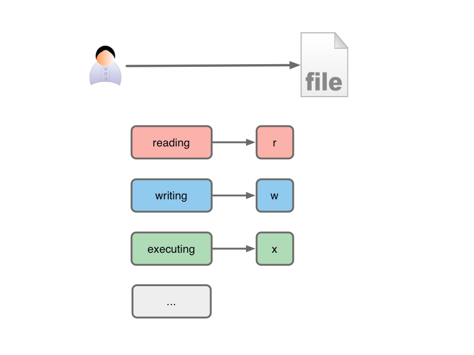
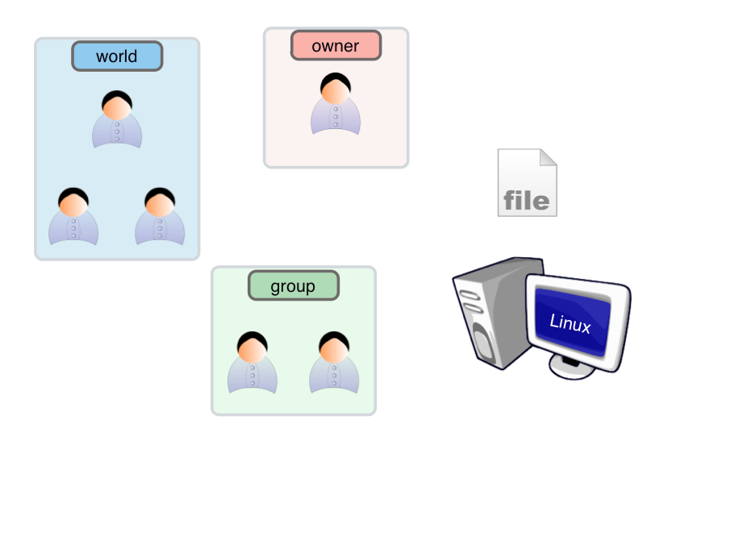
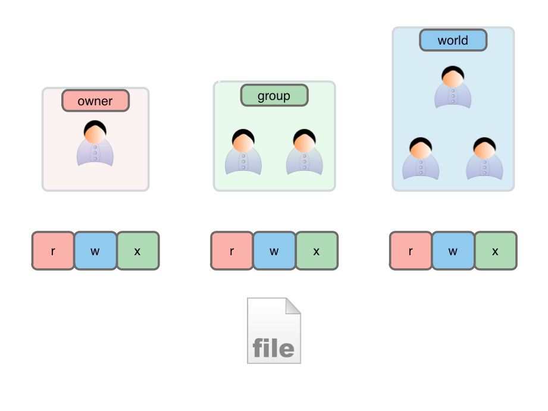
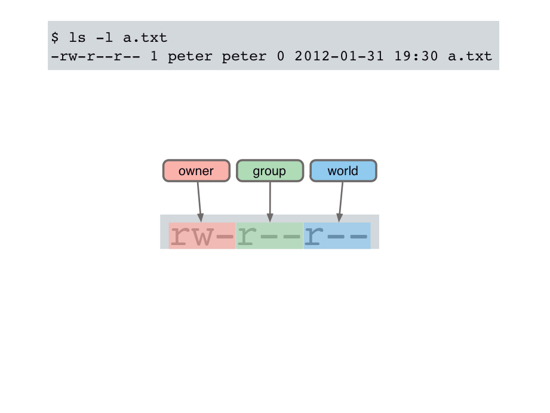

这节课要讨论的是Linux下的权限问题。比如我们试图删除一个文件

    peter@cat:~$ rm /bin/sh
    rm: cannot remove `/bin/sh': Permission denied

但是操作失败了，原因是“权限”(Permission)不够，那么

## 什么是“权限”？
用户对文件通常具有“读”，“写”，“执行”
三种权限，当然Linux系统还规定了其他一些权限，不常用。

  

我们先从常识的角度进行讨论。

对于一个特定文件，它的创立者当然可以很自由的去操作它，也就是有很多权限。创立者对于自己的朋友圈子内的人的可能给的权限要少一些，那对于陌生人呢，从“人之常情”的角度出发，给的权限就会更少一些。

  

那么我们回到实际的理论。

Linux对同一文件的权限控制，是分了三类人进行讨论的。权限问题基本上就是要讨论，所有者(owner) 对文件的是否具有“读”，“写”，“执行”的权限。同样，如果对同组用户(group)，和其他人(world)的相应讨论也完成了，那权限就明晰了。当然实际情况可能比我们刚才从常识角度的想象要灵活一些，就是：文件的创立者，虽然默认就是所有者（owner），但是文件也是可以移交给其他的所有者的，另外就是权限的多少，也不一定是按 所有者，同组，其他人这样的顺序递减的，都是可以任意更改的。

  

## 文件模式（file mode）

如果我们执行`ls -l a.txt`,
得到的输出中，我们先看一下前10个字符，第一个`-`是关于“文件类型”的，我们不关心。那剩下的9位就是“文件模式”。可以分位三组。第一组（前3位）规定的是owner对该文件的权限，`-`表示没有该权限。那就是owner对该文件只有“读"和“写”的权限。那同组和其他用户都只有读权限。

  

## 修改文件模式(chmod)

我们可以通过chmod这个命令来更改文件模式，也就是更改各类用户的具体权限。如果我们想对“组”用户和“其他”用户，在`a.txt`都加上写的权限，那么可以凭空想象出这样一个命令`chmod
rw-rw-rw- a.txt`,
但是实际这个命令系统是不认的。然后，我们用1代表“使能”，0代表“禁止”，可以得到`chmod
110110110
a.txt`，那这个逻辑也是清晰的，但是很不幸`110110110`也不是chmod的合法参数。
我们再把这个参数写的短一点，也就是把它们分三组分别八进制表示。最后得到的`chmod
666 a.txt` 是一个正确的系统命令，最后实现了我们的目的。

  

